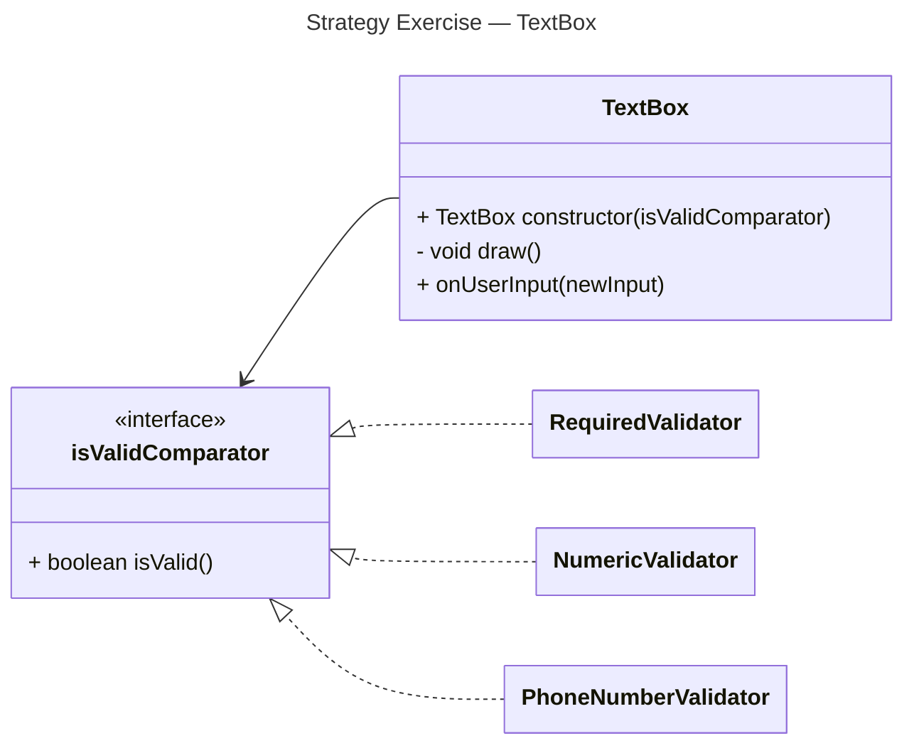

# Strategy Exercise Designs

## Question 1

> A graphical user interface (GUI) library provides a TextBox class that lets the user enter a text value.
> The visual appearance of a TextBox changes depending on whether the text currently in the box is valid or invalid.
> **What constitutes valid text is highly application-specific.**

## Question 2

> You want to create an email client class that can be used by programs to send email messages.
> When an email message is sent, sometimes the user needs to provide a login name and password, and other times they do not.
> When login name and password are required, there are many ways an application might use to obtain this information:
>   1. A console application might prompt the user in the console and ask them to enter their login name and password. Or, it might let the user specify their login name and password as command-line parameters.
>   2. A graphical application might display a dialog that prompts the user for their login name and password
>   3. An application might have a configuration file in which the user can specify their login name and password.
