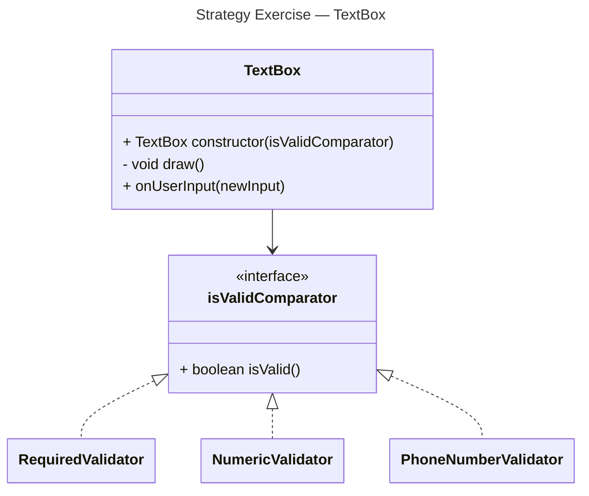
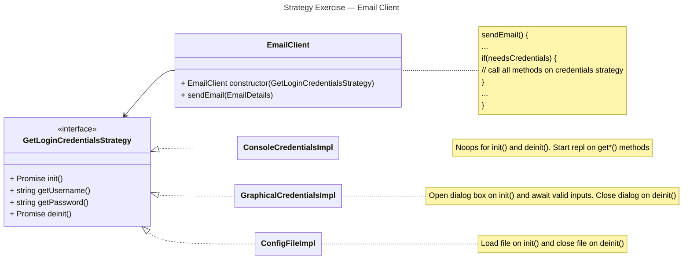
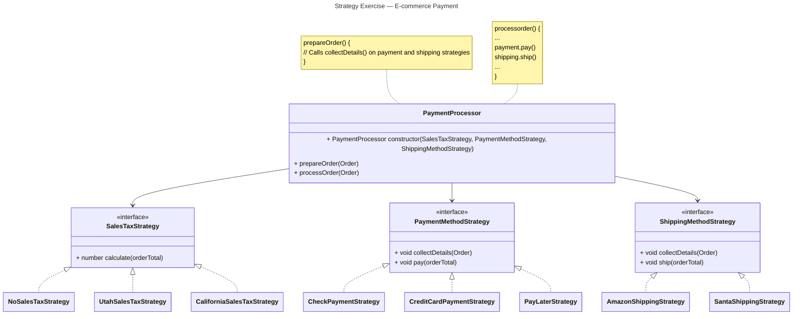
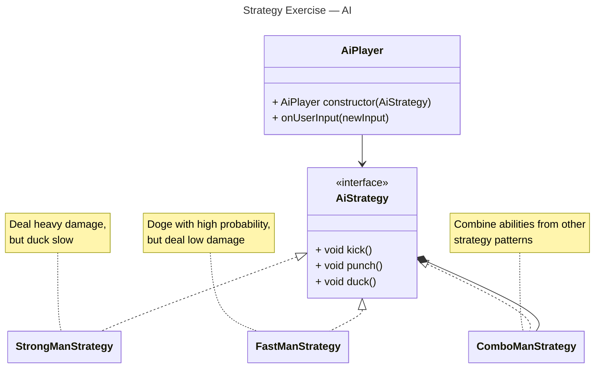

# Strategy Exercise Designs

> [!NOTE]
> Unfortunately, my diagramming tool is rendering this incorrectly. (I would file a bug report if I had more time.)\
> Specifically, the notes are showing in purple instead of yellow, and the notes do not have the UML folded corner.\
> Please appreciate that I completed the exercise and forgive the UML technicalities.

## Question 1

> A graphical user interface (GUI) library provides a TextBox class that lets the user enter a text value.
> The visual appearance of a TextBox changes depending on whether the text currently in the box is valid or invalid.
> **What constitutes valid text is highly application-specific.**

## Question 2

> You want to create an email client class that can be used by programs to send email messages.
> When an email message is sent, sometimes the user needs to provide a login name and password, and other times they do not.
> **When login name and password are required, there are many ways an application might use to obtain this information:**
>   1. A console application might prompt the user in the console and ask them to enter their login name and password. Or, it might let the user specify their login name and password as command-line parameters.
>   2. A graphical application might display a dialog that prompts the user for their login name and password
>   3. An application might have a configuration file in which the user can specify their login name and password.

## Question 3

> E-commerce applications need to process online customer orders.
> The basic process for processing an order is the same for all applications, and includes steps like calculating sales tax, taking payment, and shipping the order.
> **However, each of these steps will be somewhat different for each application:**
>   1. The algorithm for calculating sales tax will depend on the laws of the state and/or country in which the software is deployed
>   1. There are many different ways that a customer can pay: credit card, debit card, PayPal, etc.
>   1. There are many different shipping options: FedEx, US Postal Service, DHL, etc.

## Question 4

> Many video games implement “AI” (artificial intelligence) players that make it possible for human players to play against the computer.
> **An AI player might use different strategies in deciding what moves it wants to make.**
> An AI player might even use multiple strategies in combination.
> Over time, we will probably think of new strategies that AI players can use to select their moves.

